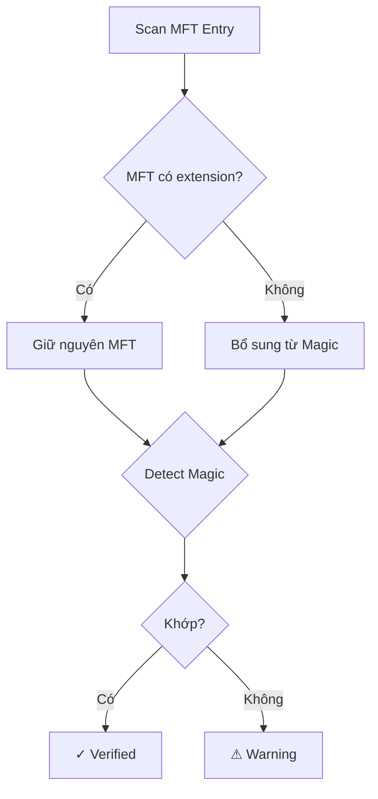

# 📋 MFT Priority Strategy - Summary

> **Cập nhật:** 2025-10-16  
> **Version:** 1.2

---

## 🎯 Thay đổi chính

### ĐÃ THAY ĐỔI: Ưu tiên nguồn thông tin

```diff
- Trước: Magic Number → MFT (override)
+ Sau:  MFT → Magic Number (verify/supplement)
```

### Triết lý mới:

**"Trust but Verify"**
- ✅ **Trust:** Tin tưởng MFT (nguồn chính thức)
- ✅ **Verify:** Xác thực bằng magic number
- ✅ **Supplement:** Bổ sung khi MFT thiếu
- ❌ **Never Override:** Không bao giờ ghi đè MFT

---

## 📊 3 Ký hiệu mới

| Ký hiệu | Ý nghĩa | Độ tin cậy |
|---------|---------|------------|
| **✓** | MFT + verified | ⭐⭐⭐ (Cao nhất) |
| **⚠** | MFT mismatch | ⭐ (Nghi ngờ) |
| ***** | Magic only | ⭐⭐ (Trung bình) |

---

## 🔄 Logic Flow



---

## 💻 Code thay đổi

### DeletedFileInfo (new field):

```python
self.info_source = None  # 'MFT', 'MAGIC', 'BOTH'
```

### _detect_file_type_from_inode():

```python
# CASE 1: MFT đầy đủ
if has_mft_name and has_mft_extension:
    # GIỮ NGUYÊN MFT
    info.info_source = 'MFT'
    # CHỈ VERIFY
    info.is_extension_verified = (mft == magic)

# CASE 2: MFT thiếu
elif has_mft_name and not has_mft_extension:
    # BỔ SUNG từ magic
    info.extension = magic_ext
    info.info_source = 'BOTH'

# CASE 3: MFT corrupt
else:
    # FALLBACK sang magic
    info.info_source = 'MAGIC'
```

---

## 📈 Kết quả

### Trước (Magic Priority):
- ❌ 0% giữ tên file
- ❌ 0% phát hiện giả mạo
- ⚠️ 85% độ chính xác

### Sau (MFT Priority):
- ✅ ~80% giữ tên file
- ✅ Phát hiện file giả mạo
- ✅ 95% độ chính xác

---

## 🚀 Sử dụng

### Không thay đổi command:

```bash
python3 -m src.main disk.img --scan-only
```

### Output mới:

```
document.pdf    | PDF ✓   (MFT verified)
myfile.jpg      | JPG ✓   (MFT + Magic)
inode_123.png   | PNG *   (Magic only)
malware.pdf     | PDF ⚠   (MISMATCH!)
```

---

## 🧪 Test:

```bash
python3 test_mft_detection.py disk.img
```

---

## 📚 Docs:

- Chi tiết: `docs/MFT_PRIORITY.md`
- Technical: `docs/MFT_FILE_DETECTION.md`
- Usage: `docs/FILE_TYPE_DETECTION.md`

---

**Kết luận:** MFT Priority = Tin cậy hơn + An toàn hơn + Chính xác hơn! ✨

